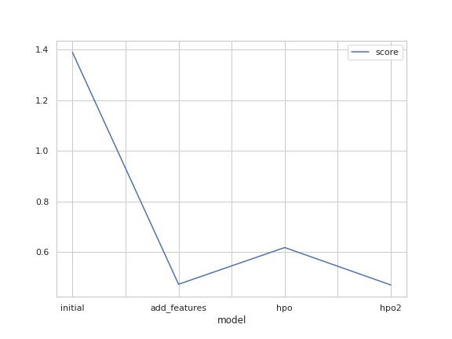

# Report: Predict Bike Sharing Demand with AutoGluon Solution
#### Soheil Rezayi

## Initial Training
### What did you realize when you tried to submit your predictions? What changes were needed to the output of the predictor to submit your results?
The negative results needed to be set to zero. Kaggle does not accept negative results for this competition.

### What was the top ranked model that performed?
For all sections, the WeightedEnsemble_L3 was the best model.

## Exploratory data analysis and feature creation
### What did the exploratory analysis find and how did you add additional features?
I added month, hour, and weekday to the dataset.
I also categorized rush hours, weather condition, wind condition, and humidity condition.
I analyzed the data for the outliers and removed count column outliers.

### How much better did your model preform after adding additional features and why do you think that is?
The score improved from 1.38865 to 0.47307.
A combination of feature engineering tasks was performed to achieve this:
First hour, month, and weekday column were extracted from date column and their dtype set to categorical.
The dtype of other categorical columns, such as season and weather were also corrected.
Outliers were also removed.

## Hyper parameter tuning
### How much better did your model preform after trying different hyper parameters?
I tried a lot of combination of hyperparameter tuning although the score did not improve. It even deteriorated after manual hyperparameter tuning. I managed to improve the score by tuning number of bag folds, bag sets, and stack levels.

### If you were given more time with this dataset, where do you think you would spend more time?
Definitely, on feature engineering. It is by far more efficient than hyperparameter tuning.

### Create a table with the models you ran, the hyperparameters modified, and the Kaggle score.

| model        | time | num_bag_folds | num_bag_sets | num_stack_levels | hyperparameter                                | score   |
|--------------|------|---------------|--------------|------------------|-----------------------------------------------|---------|
| initial      | 600  | Default       | Default      | Default          | Default                                       | 1.38865 |
| add_features | 600  | Default       | Default      | Default          | Default                                       | 0.47307 |
| hpo          | 600  | Default       | Default      | Default          | gbm={'num_boost_round':1000,                  | 0.61799 |
|              |      |               |              |                  | 'num_leaves'(lower=20,upper=64,default=32)}   |         |
|              |      |               |              |                  | nn={'num_epochs':100,'learning_               |         |
|              |      |               |              |                  | rate':(1e-4,1e-2,default=5e-4,log=True),      |         |
|              |      |               |              |                  | 'activation':('softmax'),                     |         |
|              |      |               |              |                  | layers':([100],[1000],[200, 100],             |         |
|              |      |               |              |                  | [300, 200, 100])}                             |         |
| hpo2         | 1200 | 7             | 1            | 2                | Default                                       | 0.47009 |

### Create a line plot showing the top model score for the three (or more) training runs during the project.

### Create a line plot showing the top Kaggle score for the three (or more) prediction submissions during the project.

## Summary
I improved the model by adding and changing the dataset features which resulted in reducing the RMSLE error 0.91558. I also, tuned the hyperparameters of TabularPredector. However, despite the effort and combining different combinations, hyperparameter tuning did not improve the results significantly.
